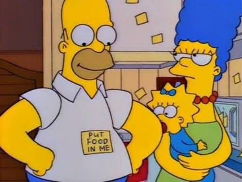

Do you ever wonder how far you could go - or could have gone - if you knew the standard you were trying to hit? 

I was recently made brutally aware of a certain cleanliness standard, the kind of standard that literally separates the men from the boys whose moms pick up after them. 

Now, I don’t consider myself messy, but I absolutely differentiated between ‘day-to-day clean’ and ‘we’re-having-company’ clean. Leaving shaving hairs in the bathroom, ignoring the odd dish in the kitchen sink, letting the chili oil spill in the refrigerator - I was willing to tolerate such messes, until I received some very concise and critical advice this past weekend: Leave every space as if you were going to immediately have people over. 

Simple? Sure. A high bar? Maybe not for every 34-year-old, but comparison is such a fruitless game. 

Had I known this was the expectation of so many past roommates, who interminably bothered me for what I considered ‘minor’ messes, I may have avoided many painful relationship riffs.

That one roommate in 2017 who felt it necessary to slap sticky-notes all over our kitchen - ‘plates and bowls’ on the bottom shelf, ‘cups and glasses’ on the top shelf, ‘pots and pans’ under the sink, etc.?

Bro, I don’t need to be treated like a kindergartener. Just give me the standard. Being primed to think that one of my old college friends could walk in the door at any moment just to check on what I’ve done with my life is way more effective than combing through a text message essay-checklist on ‘areas of concern’ in the apartment. 

Now, even if I had been given the cleaning standard in 2017, I probably would not have listened. Because I was way more petty in my 20s, and bristled at taking advice from other men.

But when the standard is given by someone you love, you’re liable to listen.

I want the standard, not incremental advice. 

Sheesh. Until next time. 

